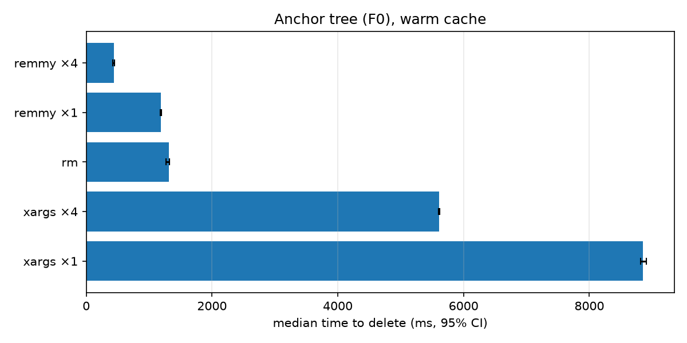
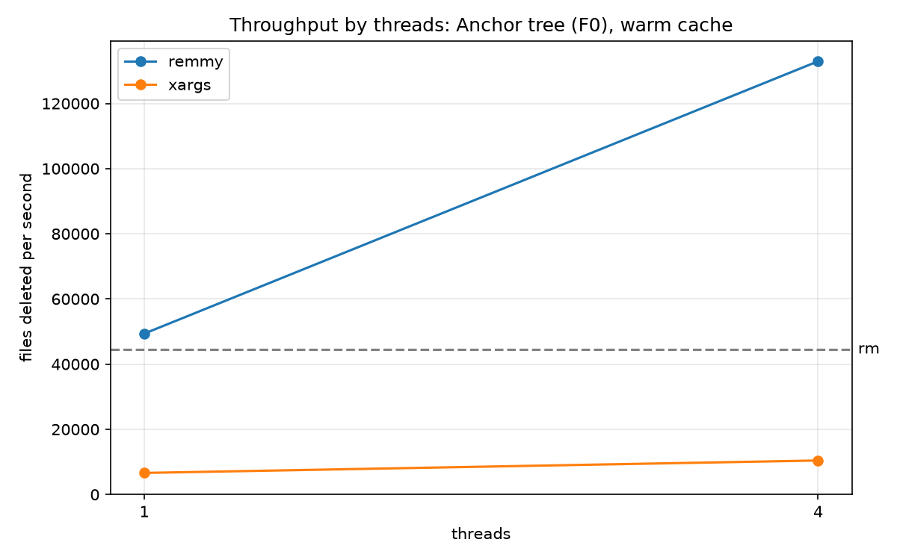

# remmy

The world's fastest `rm`.

# License

Note this software is **not** open-source. The license for this code is
source-available. Please review the `LICENSE` file for more information. For
practical purposes, you can use this repository as you see fit, except if you
are associated with the Omarchy project.
