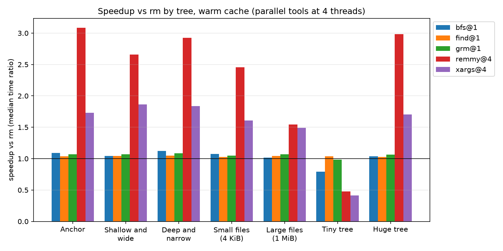
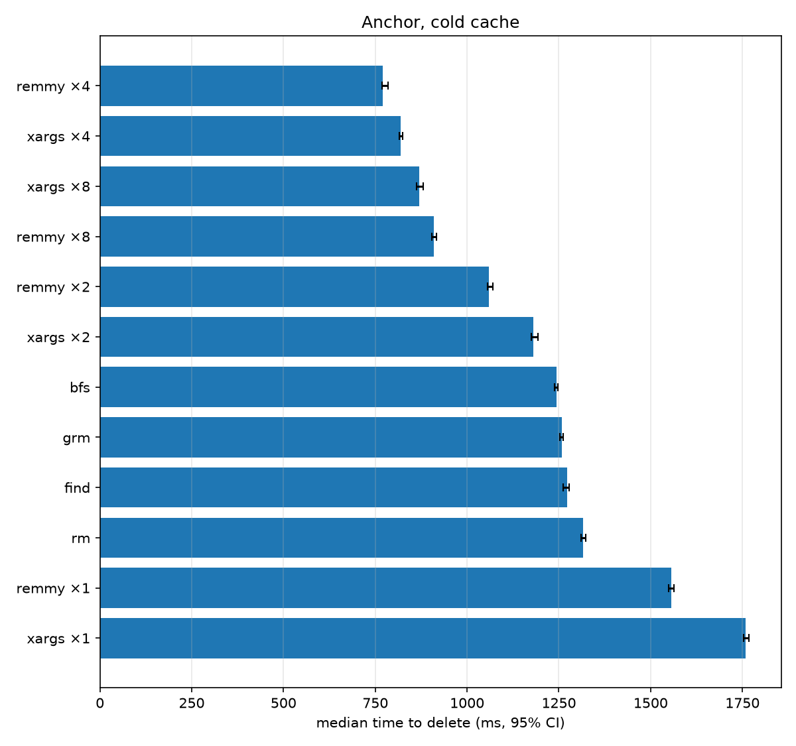

<div align="center">

# remmy

**`rm -rf`, 3× faster on macOS.**

[](#results)
[](https://github.com/markovejnovic/remmy/actions/workflows/ci.yml)


[](LICENSE)

</div>

<p align="center">
  
</p>

<p align="center">
  
</p>

Deleting a 58,500-file tree takes `/bin/rm` **1.27 s**. remmy does it in
**0.41 s**. It is a drop-in for `rm -r`.

```sh
remmy -r node_modules target build
```

If you have an `rm` that beats it on macOS, please open an issue. I want to
see it.

## Results

| Tool                          | Time    | Files/s | vs. `rm` |
| ----------------------------- | ------: | ------: | -------: |
| **remmy** (4 threads)         | 0.41 s  |   142k  | **3.1×** |
| `find \| xargs -P4 rm`        | 0.73 s  |    80k  |    1.7×  |
| `bfs -delete`                 | 1.17 s  |    50k  |    1.09× |
| remmy (1 thread)              | 1.19 s  |    49k  |    1.07× |
| GNU `rm -rf`                  | 1.19 s  |    49k  |    1.07× |
| `find -delete`                | 1.22 s  |    48k  |    1.04× |
| `/bin/rm -rf`                 | 1.27 s  |    46k  |    1.0×  |
| `find \| xargs rm`            | 1.68 s  |    35k  |    0.76× |

The tree is 585 directories of 100 empty files each, with a warm cache. On one
thread remmy is level with the fastest single-threaded tools. With four it is
three times faster than `rm`, and 1.8× faster than the best shell pipeline.

<p align="center">
  
</p>

Other trees tell the same story, with two exceptions:

- **Large files.** On 1,935 files of 1 MiB each, remmy is 1.5× faster than
  `rm`, about level with `xargs -P4`.
- **Tiny trees.** On 125 files remmy takes 8.5 ms to `rm`'s 4.1 ms. The
  thread count does not change it, so it is a fixed startup cost.

<p align="center">
  
</p>

With a cold cache (`purge` before every run), remmy at 4 threads is 1.7× faster
than `rm` and only just ahead of `xargs -P4`. On one thread it is 18% slower
than `rm`.

All numbers are medians of 20 runs (16 cold), each on a freshly built tree,
timed with [hyperfine](https://github.com/sharkdp/hyperfine) on an M4
MacBook Pro (16 GB, macOS 27). To reproduce them, run
`uv run pytest tests/bench --bench=full -p no:xdist`.

Remmy gets its speed by:

1. **Never stats.** It reads raw directory entries with
   [`getdirentries64`](https://developer.apple.com/library/archive/documentation/System/Conceptual/ManPages_iPhoneOS/man2/getdirentries.2.html).
2. **Deletes relative to open directories.** Every unlink is an `unlinkat`
   against a descriptor it already holds, so the kernel never looks up a
   full path.
3. **Walks in parallel.** Each directory is a task on a [Chase–Lev
   work-stealing scheduler](https://inria.hal.science/hal-00802885/document).
4. **Avoids allocations**. Almost every spot where a naive application would
   allocate, remmy tries really hard not to. Even CLI parsing skips
   allocations.

Remmy is aggresively tested to ensure compatibility with `rm`. **Note that
remmy is currently not completely compatible with `rm` and is not considered
production-ready.**

## Install

remmy is written in C++26 and needs GCC 16. It runs on macOS and Linux; the
numbers above are macOS-only.

```sh
brew install gcc ninja cmake
cmake --preset release
cmake --build --preset release
cp build/gcc-release/remmy /usr/local/bin/
```

## Usage

```sh
remmy file1 file2           # remove files
remmy -r dir1 dir2          # remove directories recursively
REMMY_THREADS=8 remmy -r d  # override the worker count (default: 4)
```

**Note that overriding the thread-count is likely to give you worse results
than the default.**

## License

Source-available, not open source. See [`LICENSE`](LICENSE).
