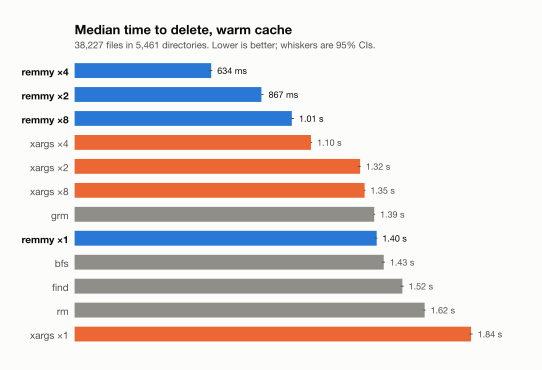
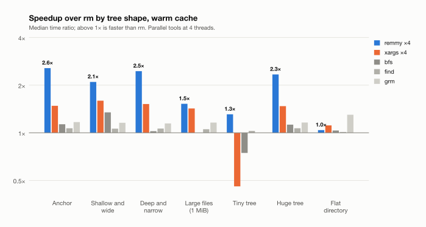

<div align="center">

# remmy

**`rm -rf`, 3× faster on macOS.**

[](#results)
[](https://github.com/markovejnovic/remmy/actions/workflows/ci.yml)


[](LICENSE)

</div>

<p align="center">
  <!-- TODO(markovejnovic): Better benchmarks -->
  <picture>
    <source media="(prefers-color-scheme: dark)" srcset=".github/res/time-dark.svg">
    
  </picture>
</p>

## Quickstart

You can grab a `remmy` version from the [Releases](TODO) page:

```bash
curl TODO
```

`remmy` has the exact-same interface and semantics as your macOS `rm` and you
can run:

```bash
remmy -r node_modules/
```

If you trust `remmy` enough, you can add an alias in your `.bashrc` to use
`remmy` instead of `rm`:

```bash
echo "alias rm='/opt/remmy/bin/rm'" >> ~/.bashrc
echo "alias unlink='/opt/remmy/bin/unlink'" >> ~/.bashrc
source ~/.bashrc
```

## Donationware

**Remmy is donationware.** That means that if you like `remmy`, if you like my
work and if you want to support remmy or me, you *should* donate. I like money
as much as the next person, but I don't need it. **There are people who do**.
Here are some institutions you can consider:

- 🌍 [United World College](https://uwc.org/support-us/) transformed my life by
  taking me from a backwater swamp and opening my eyes to different cultures,
  worldly cultures of thought and helping me be financially secure. **Help
  provide kids the same opportunity.** My cohort are all amazing people who are
  all transforming the world.
- 🇮🇷 [Children of Persia](https://www.childrenofpersia.org/) is a fund which
  provides sustainable healthcare and education support to children in Iran.
  With the ongoing war, **children need our support more than ever**. Iran is
  is one of the west's most important cultures and the hell children have to
  experience in Iran is a disgrace and an insult to Persia's **critical impact**
  to the Greco-Roman legacy. **Help kids in Iran have the opportunity to
  survive.** (_Note this is one of the few charities which directly supports
  Iran and UN donors can support._)
- 🇵🇸 [Palestine Children's Relief Fund](https://www.pcrf.net/) provides medical
  care to injured and ill children who need access to medical care. **Help kids
  survive war.** The ugly reality is many won't and we have to help as many as
  we can. If you care about _basic survival for kids in war_, this is your best
  donation place.
- 🇺🇳 [UNICEF Early Childhood Development
  Kit](https://www.unicef.org/supply/early-childhood-development-ecd-kit)
  provides toys across the world to reduce the severity of developmental issues
  to kids caught in conflicts. For many of its faults, UNICEF has helped the
  war-torn country I found myself growing up in. **Help toddlers and very young
  children develop.**
- 🇺🇸 [Donors Choose](https://www.donorschoose.org/) is [empirically
  proven](https://news.umich.edu/even-small-crowdsourced-projects-from-teachers-make-a-difference-for-students/)
  to improve kids scores in US schools by about 1%. **If you care about
  supporting kids in the US, this is the one.**
- 🇨🇳 [Standford REAP](https://sccei.fsi.stanford.edu/reap) aims to make an
  educational improvement in rural China. [Roughly 85% of toddlers growing up
in rural China experience development
delay](https://www.sciencedirect.com/science/article/pii/S014759671930023X?via%3Dihub).
  During my high-school, I have met with some of the wonderful, bright and
  curious kids in rural schools from Hebei. **Help rural Chinese kids avoid
  developmental delays and improve education** For any Chinese natives, please
  reach out to me if you know of a better charity that suits China's needs
  better.

Our future is, by definition, in the hands of our children. The only effective
way towards peace and escape from the ecological damnation is if we pour
everything we can into our future. **Email me your receipt for any of the
aforementioned and I will match with a total cap of up to $1K/mo.** Hopefully I
can figure out a better way to handle matching, but email is the best way for
now.

## Compatibility

My goal is to ensure that `remmy` is one-for-one compatible with `rm`. I've
worked at Bun for a brief period and I really know how annoying it is if tools
aren't compatible with the standard. `remmy` prioritizes compatibility over
performance.

**If your `rm` and `remmy` output are not the same, yell at me.**

## Performance

I've spent a lot of time optimizing `remmy`. Here's how it compares to other
options for removing directories:

<p align="center">
  <picture>
    <source media="(prefers-color-scheme: dark)" srcset=".github/res/speedup-by-tree-dark.svg">
    
  </picture>
</p>

| Tool                          | Time    | Files/s | vs. `rm` |
| ----------------------------- | ------: | ------: | -------: |
| **remmy** (4 threads)         | 0.41 s  |   142k  | **3.1×** |
| `find \| xargs -P4 rm`        | 0.73 s  |    80k  |    1.7×  |
| `bfs -delete`                 | 1.17 s  |    50k  |    1.09× |
| remmy (1 thread)              | 1.19 s  |    49k  |    1.07× |
| GNU `rm -rf`                  | 1.19 s  |    49k  |    1.07× |
| `find -delete`                | 1.22 s  |    48k  |    1.04× |
| `/bin/rm -rf`                 | 1.27 s  |    46k  |    1.0×  |
| `find \| xargs rm`            | 1.68 s  |    35k  |    0.76× |

Here's what remmy does (or doesn't do) to speed stuff up.

1. **Avoids calling `stat`** It reads raw directory entries with
   [`getdirentries64`](https://developer.apple.com/library/archive/documentation/System/Conceptual/ManPages_iPhoneOS/man2/getdirentries.2.html).
2. **Walks in parallel.** Each directory is a task on a [Chase–Lev
   work-stealing scheduler](https://inria.hal.science/hal-00802885/document).
3. **Deletes relative to open directories.** Every unlink is an `unlinkat`
   against a descriptor it already holds, so the kernel never looks up a
   full path.
4. **Avoids allocations**. Almost every spot where a naive application would
   allocate, remmy tries really hard not to. Even CLI parsing skips
   allocations.

### Detailed Benchmarks

TODO

## Contributing

Thank you for wanting to contribute! Here are some quick notes:

### AI Disclosure

**I have used AI in this project.** `remmy`, for the most-part, is
hand-written. Areas where code has not been hand-written and/or have had a
cursory, rudimentary review, are marked as such. These are generally low-risk
areas. **None of the tests are hand-written**.

**Note that I expect all PRs to use no more AI than I have.**

### Some Contributing Rules

- Be nice and respectful in the issues/PRs. If you are mean to people, I will
  immediately ban you from the project.
- **Note the license is not open-source. It is very close to GPLv3, but it is
  not GPLv3.** For the most part, this is due to an exclusion for the Omarchy
  project to use `remmy`.
- You are very welcome to open issues and/or PRs. I will do my **absolute
  best** to help you push your PRs across the finish line.
- I will not accept AI PRs. _I get to use AI because I maintain the project and
  I understand what my agents are doing. I do not understand what your agents
  are doing._ You are welcome to use AI as much as you want, but AI-generated
  PRs, overly-documented slop PRs will be immediately closed. I expect you to
  understand your code as if you wrote it by hand. I will label delinquent PRs
  as such and you are **more than welcome to ping me if you think I
  misclassified your PR**. You are welcome to use aggressive AI for tests, and
  I will perform only a cursory review on those as the risk is minor.

## License

Source-available, not open source. See [`LICENSE`](LICENSE).
